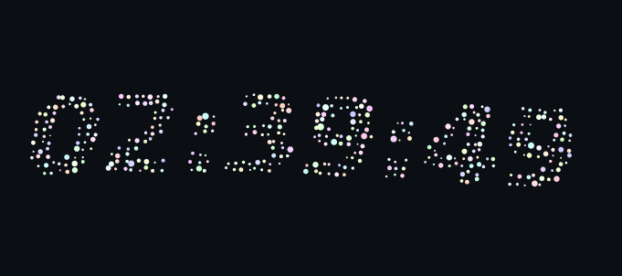

# Vanilla JS Particle Clock 🍬

水面に浮かぶようなパーティクルで時刻を描画するシンプルな時計です。  
カラフルでグミやキャンディのような質感を持ち、ブラウザ上でゆったりと揺らぎます。



## 特徴 ✨

- **Vanilla JavaScript** のみで実装、依存ライブラリなし
- 粒子は水面の波に揺らぐように配置
- 各粒子は「呼吸」するように大きさが変化
- 粒のサイズやタイミングに応じて**色相がカラフルに変化**
- 高 DPI ディスプレイにも対応

## 使い方 🚀

1. リポジトリをクローン

```bash
git clone https://github.com/yourname/vanilla-particle-clock.git
cd vanilla-particle-clock
```

2. `index.html` をブラウザで開くだけで動作します。

## カスタマイズ 🎨

コード冒頭の定数を編集すると演出を変えられます：

- `AMP_X`, `AMP_Y` : 波の振幅
- `SIZE_PERIOD` : 粒の呼吸周期
- `HUE_BASE_MIN`, `HUE_BASE_MAX` : 基本色域
- `SIZE_HUE_SWING`, `TIME_HUE_SWING` : 色相変化の幅

## ライセンス 📜

MIT License

---

✍️ このプロジェクトは **ChatGPT 5** によって生成されました。
